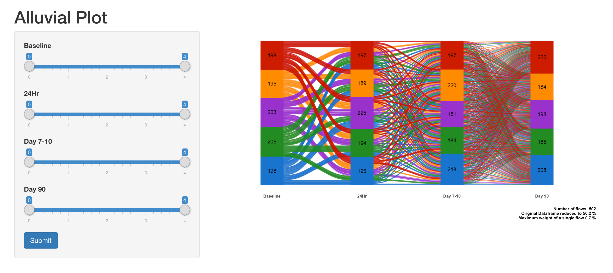

# Alluvial-Shiny-App
The app.R script in this repository creates an interactive alluvial plot with R Shiny. The data is created within the R script. The visualization can be recreated by either
copying and pasting the script into your R session, or by downloading the repository and opening and running the R script. 

